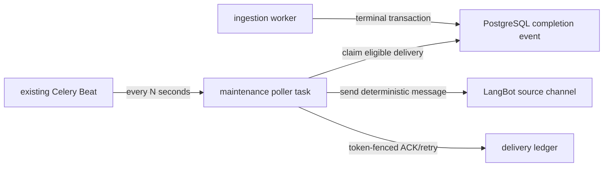

# 定时轮询完成事件并通知来源 Channel：技术设计

## 1. End-to-end boundary

数据流按以下责任分离：

1. inbound bridge 把 Telegram/微信私聊的 bot UUID 和 conversation ID 作为受信 envelope 交给
   `ChannelService`；
2. `ChannelService` 创建/复用含精确路由字段的 `ConversationThread`；
3. save/retry admission 把当前 thread ID 固化到新 `IngestDispatch`；
4. ingestion terminal transaction 创建 `IngestCompletionEvent`，不再向无人消费的 Redis
   completion queue 发布；
5. 现有 Celery Beat 定时向 `maintenance` 投递一个无参数 poller task；
6. poller 从 PostgreSQL claim eligible event delivery，验证原 thread/identity/item 后调用
   LangBot 官方 `send_message` API；
7. 平台接受后用 claim token 条件标记 delivery succeeded，失败则写入下一次可重试时间。

通知不是 ingestion transaction 的一部分。LangBot 或 poller 暂时不可用时 item/dispatch 保持
真实终态，notification delivery 由后续 Beat tick 恢复。



## 2. Source target persistence

`IngestDispatch` 增加：

```text
source_thread_id bigint nullable
  -> conversation_thread(id) ON DELETE SET NULL
```

不复制或解析 `request_key`。`ConversationThread` 是 server-owned、tenant-scoped、每个外部
conversation 一条的规范地址，且 routing 字段没有更新入口：

```text
channel_identity_id
channel                  # telegram | wechat | mcp ...
account_id               # LangBot bot UUID
external_conversation_id # Telegram chat[#topic] or WeChat wxid
```

admission 接收 `source_thread_id` 作为内部参数，并在同一 transaction 内验证：

- thread.app_user_id == tenant.app_user_id；
- thread.channel_identity_id == tenant.channel_identity_id；
- thread routing tuple 与 active `ChannelIdentity` 一致；
- thread.channel 是 telegram/wechat；
- 当前 bridge 只产生 `PersonMessageReceived`，因此 target_type 固定 `person`。

验证成功才写 `dispatch.source_thread_id`；MCP/CLI/unsupported channel 写 NULL。重放既有
dispatch 不更新 source target。`ON DELETE SET NULL` 让 identity/thread 删除不影响 ingestion
audit，同时确保迟到通知 fail closed。

`PendingChannelAction.thread_id` 已保存原始 confirmation thread，且只能在同一 thread 被确认；
confirm 后 `_submit()` 传这个 thread ID。不得解析 `request_key`，也不得用当前 tenant 的最新
linked channel 替换原会话。

## 3. Notification delivery ledger

新增 `ingest_completion_delivery`：

```text
id                 bigint primary key
event_id           bigint not null -> ingest_completion_event(id) on delete cascade
handler_key        text not null  # source-channel.notification.v1
status             text not null  # claimed | succeeded | failed
disposition        text nullable  # sent | skipped_no_channel | skipped_deleted |
                                  # skipped_identity_disabled | skipped_owner_disabled |
                                  # skipped_target_mismatch | terminal_failure |
                                  # retry_exhausted
claim_token        text nullable
claimed_at         timestamptz nullable
attempts           integer not null default 0
next_attempt_at    timestamptz nullable
last_error_code    text nullable
completed_at       timestamptz nullable
created_at         timestamptz not null
updated_at         timestamptz not null
unique(event_id, handler_key)
```

约束：

- `claimed` 必须有 claim_token/claimed_at、没有 next_attempt/completed/error；
- `succeeded` 必须有 allow-listed disposition/completed_at，清空 claim、next_attempt/error；
- retryable `failed` 必须有 stable error code 与 next_attempt_at，清空 active claim；
- terminal/retry-exhausted `failed` 必须有 stable disposition/error，next_attempt_at 为 NULL；
- attempts >= 1；索引覆盖 `(status, next_attempt_at, claimed_at)`；
- event 物理删除 cascade ledger，迟到 sweep 安全 no-op。

缺少 delivery row 表示尚未领取，不额外维护 `pending` 状态。这样历史 event 可以被同一选择器
发现；历史 dispatch 没有 `source_thread_id` 时会一次性记录 `skipped_no_channel`。

## 4. Periodic selection and claim state machine

Celery task：

```text
name:     app.ingest.tasks.deliver_pending_ingest_notifications_task
queue:    maintenance
args:     []
schedule: INGEST_NOTIFICATION_INTERVAL_SECONDS (default 10)
```

Beat 是 scheduler，不是 mutex。即使误启两个 Beat 或上一次 task 尚未结束，数据库 claim 仍保证
正常路径只发一次。

每次 task 使用一个 batch 上限和小于 10 秒调度周期的整轮 wall-clock deadline。准备发起每次
HTTP 前重新计算 remaining budget，transport timeout 取配置值与 remaining budget 的较小值，
避免一个 tick 长期占用共享 `maintenance` worker：

1. 按 `(event.created_at, event.id)` 选择以下候选：没有 delivery、到期 failed、或超过 stale
   timeout 的 claimed；
2. 在短 transaction 中对候选 event/delivery 使用 `FOR UPDATE SKIP LOCKED`；
3. insert-or-lock `(event_id, source-channel.notification.v1)`，再次检查状态；
4. `succeeded`、fresh `claimed`、未到 `next_attempt_at` 或已 exhausted → 当前 tick 跳过；
5. eligible row 写新随机 token、数据库时间、attempt+1、`status=claimed`；
6. commit claim 后逐个执行 LangBot HTTP，不持有数据库锁；
7. 使用 `event_id + handler_key + claim_token + status=claimed` 条件 ACK success/skip/failure；
8. deadline 到达后停止领取/发送，其余 row 留给下一 tick。

单条失败只影响该 row。task 本身不使用 Celery autoretry；数据库/worker/Beat 短暂故障都由下一
tick 加 stale recovery 修复。

如果 HTTP 已成功而进程在 ledger ACK 前崩溃，stale recovery 会再次发送。这是官方 LangBot
endpoint 缺少 idempotency contract 下不可消除的 at-least-once 窗口；正常重复 tick 在
`succeeded` ledger 上不会重复发送。

## 5. Retry schedule

transient 失败按稳定配置计算：

```text
delay = min(base_seconds * 2 ** (attempts - 1), max_seconds)
next_attempt_at = db_now + delay
```

可以启用 bounded jitter，但测试必须注入确定性随机源。达到 `max_attempts` 后写
`status=failed, disposition=retry_exhausted, next_attempt_at=NULL`，等待显式 re-drive 将其恢复为
eligible failed。400/401/403/404、非法 target 或 contract invalid 不做自动重试，写 terminal
failure；429/5xx/connect/timeout 才自动退避。

## 6. Trusted target resolution

poller 用 event ID 从 DB 加载 event、dispatch、item、owner、source thread 和
`ChannelIdentity`，并在每次 send 前检查：

- source_thread_id 非 NULL，channel ∈ {telegram,wechat}；
- thread.app_user_id == item.user_id；
- identity.id == thread.channel_identity_id，identity owner 相同；
- identity channel/account 与 thread snapshot 相同，identity/owner 未 disabled；
- item.deleted_at 和 purge_claimed_at 均为 NULL；
- event snapshot 是四种数据库约束允许的终态组合。

thread.closed_at 不阻止通知，因为 `/new` 只重置 Agent history，外部 conversation address
不变。不按 tenant 查“最新 identity”，不把通知切换到 linked channel。

## 7. Deterministic message rendering

固定模板，不调用模型：

| Snapshot | User message intent |
| --- | --- |
| `completed + ready` | 已解析并加入知识库，可以开始提问 |
| `completed + needs_extension` | 已保存，需要浏览器扩展补充文本后才能检索 |
| `completed + needs_asr` | 已保存，需要语音识别后才能检索 |
| `failed + failed` | 解析失败，请稍后在知识库中重试 |

label 优先使用 title，但先删除控制字符、折叠空白、限制 Unicode code point 数；空值使用固定
“你提交的视频”。不附带 URL、字幕、provider error、storage key 或内部 event/tenant ID。
title 只存在 outbound body，不存在日志、ledger、diagnostic、task result。

## 8. LangBot outbound client

配置：

```dotenv
LANGBOT_OUTBOUND_BASE_URL=http://127.0.0.1:5300
LANGBOT_OUTBOUND_API_KEY=<dedicated LangBot API key>
LANGBOT_OUTBOUND_TIMEOUT_SECONDS=10
```

request：

```text
POST {base}/api/v1/platform/bots/{urlencoded account_id}/send_message
X-API-Key: <secret>
Content-Type: application/json

{
  "target_type": "person",
  "target_id": "<thread.external_conversation_id>",
  "message_chain": {"root": [{"type": "Plain", "text": "<bounded template>"}]}
}
```

实现必须以 LangBot SDK 的实际 `MessageChain` JSON schema 测试为准。client 禁止 redirect，
使用 bounded connect/read/total timeout；HTTP 只允许 loopback，非 loopback 必须 HTTPS。
401/403/400/404 为 terminal config/target category，429/5xx/timeout/connect 为 retryable；任何
response body 或 exception text 均被丢弃。

LangBot v4.10.6 patch 同步修改 `send_message` route：删除 `traceback.print_exc()` 和
`str(exception)` response，改为固定安全 500。fixed-wheel 测试必须证明 patch 可应用、文件可
编译、接口仍要求 API key 且失败文本不含 sentinel。

## 9. Retiring the unused broker path

`IngestCompletionEvent.publish_state` 是历史 broker publisher 状态，不是 delivery 状态。为避免
滚动部署时破坏旧版本，本任务保留这些列，但新 poller 完全忽略它们。

权威 poller 上线时同时执行：

1. 新代码停止 terminal transaction 后的 `publish_ingest_completion_event()` best-effort call；
2. Beat schedule 用 notification poller 替换 `publish-pending-ingest-completion-events`；
3. 旧 publisher service/task 可以暂留作 rollback compatibility，但不再有自动或请求内入口；
4. 先停旧 producer 版本，再确认数据库 completion event 可被 poller 覆盖；
5. 记录 `ingest-completion` queue backlog，在明确确认后清理其中仅含 event ID 的冗余 envelope；
6. 不运行 queue consumer 与 poller 同时发送 `source-channel.notification.v1`。

历史 `publish_state=claimed/enqueued/pending` 不影响 notification eligibility。未来清理 legacy
broker columns/queue 是独立 schema cleanup，不与本次可靠通知上线绑定。

## 10. Deployment and monitoring

继续使用现有进程：

```bash
.venv/bin/celery -A app.ingest.tasks:celery_app worker \
  --loglevel=INFO --queues=ingest,maintenance
.venv/bin/celery -A app.ingest.tasks:celery_app beat --loglevel=INFO
```

只启动一个 Beat 以减少重复 tick，但 correctness 不依赖这一点。maintenance worker 需要 DB、
Redis、LangBot base URL/API key 和安全 TLS/timeout 配置；poller batch/time budget 必须保证不会
长期占住 purge 等 maintenance 工作。

增加固定安全 diagnostics：最近成功 tick、claimed/succeeded/skipped/failed/deferred、最老
eligible backlog age、failed ledger 数。它们不进入 MCP readiness；通知停摆不阻断 ingestion
和 read-only API。

LangBot 默认可能绑定 `0.0.0.0` 且 CORS 开放；部署必须用 host firewall/reverse proxy 限制
API，首版本地 HTTP 只连 127.0.0.1/localhost。优先签发 dedicated `lbk_` key，不复用
admin/browser token。

## 11. Rollout and rollback

上线顺序：migration → patched LangBot core + dedicated API key/network restriction → 带 source
target 和 poller 的应用代码 → 停旧 producer/确认新 Beat schedule → 观察 eligible backlog 与
failed ledger → 安全处理旧 Redis backlog → Telegram/微信私聊 E2E。

回滚时先禁用 notification Beat entry 或回到没有 poller schedule 的代码；保留
`source_thread_id`、delivery ledger、completion event 和 failed/backlog 现场。ingestion 和
maintenance purge 继续。不得通过重跑 ingestion、删除数据库 event 或同时启动旧 queue
consumer 来恢复通知。
