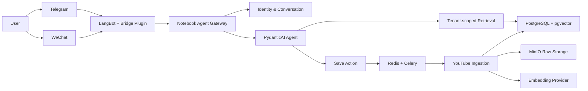

# Notebook Agent

[English](README.md) | [简体中文](README.zh-CN.md)

> Your private knowledge, available wherever you chat.

**EAZO Global Hackathon Project**

Notebook Agent is a multi-channel private knowledge agent for individuals. Send a video link through Telegram or WeChat to turn it into searchable knowledge. Later, ask questions in natural language and the agent will retrieve evidence from your own library, returning answers with source titles, original excerpts, and timestamped video links.

It addresses a familiar problem: we save more videos and articles than ever, but rarely find the exact quote, idea, or explanation when we actually need it.

## Demo: From Saved Content to Answers

1. **Save content**: Send the bot `Save this <YouTube URL>`.
2. **Process automatically**: The system extracts metadata and captions, creates semantic chunks, generates embeddings, and builds the index asynchronously.
3. **Ask anytime**: For example, “Which video in my library discussed product demand validation?”
4. **Return to the source**: Every answer includes real evidence and timestamped links to the relevant moment in the video.

```text
User: Save this https://youtu.be/...
Agent: Added to the processing queue. It will become searchable when ready.

User: What does this video recommend for building reliable AI agents?
Agent: ...
       [1] Video title · 08:42 · Original excerpt
```

## Core Features

| Capability | Description |
| --- | --- |
| Conversational capture | Save 1–10 explicit video URLs using natural language. A bare URL requires confirmation to prevent accidental saves. |
| Video knowledge ingestion | Extract YouTube metadata and captions, split content along semantic and temporal boundaries, and generate vector indexes. |
| Hybrid retrieval | Combine keyword search with pgvector semantic search to find relevant content even when the wording differs. |
| Traceable answers | Answers may cite only evidence returned during retrieval and include source titles, excerpts, and timestamped links. |
| Multi-step agent | Search segments, expand surrounding context, inspect item metadata, and open an exact source location. |
| MCP evaluation entry point | Use the standard `mcp==2.0.0` stdio or Streamable HTTP server without installing LangBot. |
| Multi-channel access | Optionally connect Telegram and WeChat through LangBot while keeping channel adapters separate from the agent core. |
| Private knowledge spaces | Data is isolated by user. Model tools cannot accept or alter `user_id`, and cross-user resources remain invisible. |
| Cross-channel identity linking | Use short-lived, single-use codes to access the same private library from another channel. |
| Persistent conversations | Recent turns live in PostgreSQL and survive restarts. Use `/new` to start with a clean context. |
| Asynchronous processing | Redis and Celery handle fetching, chunking, and embedding without blocking chat requests. |
| Inventory and recycle bin | Tenant-scoped list/detail views, bounded `why_saved` updates, confirmed soft-delete, restore, failed-ingestion retry, and a 30-day bounded purge. |

## More Than a RAG Demo

Notebook Agent treats reliability and privacy boundaries as product features, not afterthoughts:

- **Evidence first**: Every ordinary knowledge question requires a query embedding and a real knowledge-base search. If retrieval is unavailable, the request fails explicitly instead of falling back to model memory.
- **Citation integrity**: Final answers can use only server-approved segment IDs. Fabricated citations are rejected and regenerated; an unverified draft is never returned if repair fails.
- **Tenant by construction**: Trusted channel events resolve the user before agent execution. Tenant identity is fixed in dependencies and never exposed in the model's tool schema.
- **Secure channel bridge**: The optional LangBot bridge listens only on loopback and validates HMAC signatures, timestamps, and nonces. Replays and duplicate message deliveries do not produce duplicate replies.
- **Revocable MCP principals**: Bearer capabilities are generated with at least 256 bits of entropy, stored only as hashes, and resolved to a tenant and `read`/`full` scope on every request. Raw tokens are shown only on issue/rotation; URL compatibility uses a redacted path, never a query parameter.
- **Safe confirmation flow**: Pending actions belong to one user and conversation, expire after ten minutes, and can be consumed only once.
- **Recoverable execution**: Content jobs use durable dispatch records and idempotency boundaries, so duplicate delivery does not repeat the full ingestion pipeline.

## Architecture



### Content Pipeline

```text
URL → Metadata/Captions → Validation → Raw Archive → Semantic Chunking → Embedding → pgvector → Searchable
```

YouTube is the currently supported end-to-end ingestion source. The data model reserves a unified content and segment structure for Bilibili videos and WeChat Official Account articles, but those connectors are not yet implemented and are therefore not presented as available features.

## Technology Stack

- **Agent**: PydanticAI with native providers and OpenAI-compatible gateways
- **Database**: PostgreSQL 17, pgvector, SQLAlchemy, Alembic
- **Retrieval**: Vector cosine search plus PostgreSQL full-text search and Chinese trigram search
- **Ingestion**: yt-dlp, Celery, Redis
- **Object storage**: MinIO and other S3-compatible storage
- **MCP**: official Python SDK `mcp==2.0.0` (stdio and Streamable HTTP)
- **Channels (optional)**: LangBot 4.10.6, Telegram, WeChat OpenClaw/iLink
- **Embedding**: Zhipu Embedding-3 with 1,536 dimensions
- **Quality**: Pytest, structured diagnostics, idempotency tests, and tenant-isolation tests

## Quick Start

### 1. Requirements

- Python 3.11+
- Docker and Docker Compose
- An agent model API and a Zhipu Embedding API key
- LangBot 4.10.6 and Telegram/WeChat credentials only for the optional personal-channel integration

### 2. Install and Initialize

```bash
git clone YOUR_REPOSITORY_URL
cd notebook-agent

python -m venv .venv
source .venv/bin/activate
python -m pip install -e '.[dev]'

cp .env.example .env
# Choose a runtime profile in docs/environment-configuration.md, then fill
# only the database/provider/infrastructure values that profile requires.

docker compose up -d
alembic upgrade head
```

### 3. Start the Core MCP Server

Notebook Agent can be evaluated without LangBot. Run the local protocol over
stdio (stdout is reserved for MCP protocol bytes; diagnostics go to stderr):

```bash
.venv/bin/python -m app.cli mcp-grant issue --user-id <user-id> --scope read --label local-stdio
MCP_TOKEN='<raw-token>' \
  .venv/bin/python -m app.cli mcp-server --transport stdio
```

For a local stdio client, launch the subprocess with an operator-issued grant
token in its private environment (`MCP_TOKEN=<raw-token>`). The process
resolves that token through the same hash-only grant table before registering
the scope-specific tools; missing or invalid tokens fail closed.

For a hosted evaluator, use Streamable HTTP. It binds to `127.0.0.1:8000` and
serves `/mcp` by default; put a public deployment behind TLS and a proxy that
omits or redacts request URIs. Prefer `Authorization: Bearer <token>`. If a
URL-only evaluator cannot send headers, explicitly set `MCP_URL_TOKEN_MODE=true`
and issue a grant URL at `/mcp/c/<opaque-token>`; query-string tokens are
rejected. Create and rotate grants with `mcp-grant issue|rotate`; raw bearer
material is printed only by those two commands and is not recoverable later.

```bash
.venv/bin/python -m app.cli mcp-server --transport streamable-http
```

`tools/list` verifies only protocol connectivity. A measured smoke must call
`ask_notebook_agent` with a natural-language question so the request reaches
the Notebook Agent model/retrieval path. The browser/demo profile should use a
`read` grant and a fresh high-entropy conversation id per browser session;
trusted `full` grants expose the typed save/inventory/delete/restore/retry
tools.

### 4. Start the Worker and Gateway

On the first deployment, keep `AGENT_SAVE_ENABLED=false` in `.env` and start the ingestion worker:

```bash
.venv/bin/celery -A app.ingest.tasks.celery_app worker --queues=ingest,maintenance
.venv/bin/celery -A app.ingest.tasks.celery_app beat
```

The worker and beat are also the durability boundary for terminal ingestion
events. The producer declares a durable `ingest-completion` queue, but the
existing worker must not consume that queue until a real idempotent completion
consumer is deployed. Beat periodically repairs pending/stale outbox claims;
check its counters and the queue backlog during rollout. The bundled Redis uses
a persistent volume with AOF `appendfsync=always`; a remote broker must provide
equivalent durability before acknowledging a published completion message.

After the worker is ready, change `AGENT_SAVE_ENABLED` to `true` and start the gateway:

```bash
.venv/bin/python -m app.cli gateway-server
```

Start with the [environment configuration guide](docs/environment-configuration.md)
for copyable read-only, full, HTTP/MiXer, and optional LangBot profiles. See the
[deployment guide](docs/deployment.md) for process ordering, Linux services,
backup, rollback, upgrades, and troubleshooting.

## Try It Locally with the CLI

You can validate the data and question-answering flow without connecting a chat platform:

```bash
# Create a local user and note the returned user ID.
python -m app.cli users create

# Replace 12 with the returned user ID, then ingest a video.
python -m app.cli ingest --user-id 12 'https://youtu.be/...'

# Compare keyword and vector retrieval results.
python -m app.cli search --user-id 12 'your query'

# Ask the agent a question.
python -m app.cli ask --user-id 12 --thread demo 'What is the main idea of this video?'
```

## Chat Commands

| Command | Purpose |
| --- | --- |
| `/start` | Register automatically or confirm the current account and return its internal user ID. |
| `/whoami` | Show the internal user ID linked to the current channel identity. |
| `/new` | Start a new conversation without loading the previous context. |
| `/link wechat` | Generate a WeChat linking code from an authenticated channel; Telegram works the same way. |
| `/link <code>` | Consume a linking code on the named target channel and connect it to the same private library. |

Telegram and WeChat are the supported linking pair. Codes expire after the configured TTL (10 minutes by default), are restricted to the named target channel, and can succeed only once. The target account may already have used `/start`, `/whoami`, ordinary chat, or saved content: its tenant, identities, conversations, and knowledge are merged into the code-generating source tenant. Duplicate saved content is reconciled automatically. If target ingestion is currently running, retry the same code after processing finishes.

Channels linked to the same user share a knowledge library but keep separate conversation histories by default, preventing accidental context mixing. A completed merge cannot be undone through chat commands; take the normal PostgreSQL backup before deployment and use administrative recovery for any later split. Linking codes necessarily appear in the two platform messages but are stored only as hashes and must never be copied into application logs.

## Model Configuration

You can use any provider supported by PydanticAI. For an OpenAI-compatible gateway, configure:

```dotenv
AGENT_MODEL=openai:your-model-name
AGENT_API_KEY=...
AGENT_BASE_URL=https://your-gateway.example/v1
```

`AGENT_BASE_URL` changes only the provider connection. It does not alter tools, prompts, tenant boundaries, or the answer contract.

## LangBot Multi-Channel Integration

The bridge plugin lives in [`integrations/langbot_kb_plugin/`](integrations/langbot_kb_plugin/). It converts trusted platform events into a common `ChannelEnvelope` and routes responses; Notebook Agent continues to own identities, conversations, model execution, and retrieval permissions.

To connect LangBot:

1. Configure the same `CHANNEL_GATEWAY_SECRET` of at least 32 characters in Notebook Agent and the plugin.
2. Enable Telegram and OpenClaw/iLink WeChat adapters in LangBot.
3. Use `KB_BOT_CHANNELS` to map every LangBot bot UUID explicitly to `telegram` or `wechat`.
4. Apply [`integrations/langbot-4.10.6-redact-monitoring.patch`](integrations/langbot-4.10.6-redact-monitoring.patch) so monitoring paths do not copy private message bodies or external identities.
5. Start the Notebook Agent gateway and plugin runtime before starting LangBot.

See the [LangBot bridge section](docs/deployment.md#7-安装-langbot-桥接可选) of the deployment guide for configuration and readiness checks.

## Project Structure

```text
app/
├── agent/          # Agent runtime, tools, providers, and answer contracts
├── channels/       # Identity, conversations, commands, confirmations, and HTTP gateway
├── connectors/     # Content platform connectors; currently YouTube
├── ingest/         # Fetching, validation, chunking, embedding, and Celery tasks
├── retrieval/      # Keyword and vector retrieval
├── cli.py          # Operations, local ingestion, search, and question answering
└── models.py       # Multi-tenant knowledge and conversation models

integrations/       # LangBot bridge plugin and security patch
migrations/         # Alembic database migrations
docs/               # Deployment, upgrades, rollback, and troubleshooting
tests/              # Unit, integration, security-boundary, and PostgreSQL tests
```

## Verification

```bash
pytest -q
alembic current
alembic check
python -m app.cli ask --help
python -m app.cli users --help
```

Automated migration downgrade tests must run only against a temporary, disposable PostgreSQL database. Never run destructive downgrade verification against a normal local or production database.

---

Built for the **EAZO Global Hackathon** — turning scattered saved content into a private, searchable memory.
