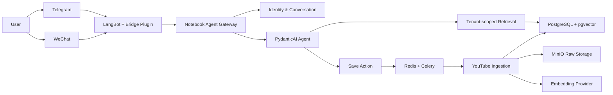

# Notebook Agent

[English](README.md) | [简体中文](README.zh-CN.md)

> 让你的私人知识，在每一个聊天入口触手可及。

**EAZO Global Hackathon Project**

Notebook Agent 是一个面向个人的多渠道私有知识库 Agent。用户只需在 Telegram 或微信中发送视频链接，就能把内容沉淀为可检索的知识；之后直接用自然语言提问，Agent 会从用户自己的知识库中寻找证据，并返回带标题、原文片段和视频时间戳的回答。

它希望解决一个很常见的问题：我们收藏了大量视频和内容，却很难在真正需要时重新找到其中的某句话、某个观点或某段解释。

## Demo：从收藏到答案

1. **保存内容**：向机器人发送“帮我保存 `<YouTube URL>`”。
2. **自动处理**：系统异步获取元数据与字幕，完成语义切分、向量化和索引。
3. **随时提问**：例如“我收藏的视频里，谁讲过如何验证产品需求？”
4. **回到原文**：回答附带真实来源与时间戳，可直接跳转到视频对应位置。

```text
用户：帮我保存 https://youtu.be/...
Agent：已加入处理队列，完成后即可检索。

用户：这个视频对 AI Agent 的可靠性有什么建议？
Agent：……
       [1] 视频标题 · 08:42 · 原文片段
```

## 核心功能

| 能力 | 说明 |
| --- | --- |
| 对话式收藏 | 通过自然语言保存 1–10 个明确的视频链接；只发送裸链接时会先请求确认，避免误操作。 |
| 视频知识化 | 自动提取 YouTube 元数据和字幕，按语义与时间边界切分，并生成向量索引。 |
| 混合检索 | 结合关键词检索与 pgvector 语义检索，在表达不同但语义相关时也能找到内容。 |
| 可追溯回答 | 回答只能引用本次检索得到的真实证据，并附带标题、片段与时间戳链接。 |
| 多步 Agent | Agent 可搜索片段、展开上下文、读取内容详情，并跳转到具体位置。 |
| 多渠道访问 | 通过 LangBot 同时连接 Telegram 与微信；渠道层和 Agent 核心相互独立。 |
| 私有知识空间 | 数据按用户隔离，模型工具无法传入或修改 `user_id`，跨用户资源统一不可见。 |
| 跨渠道身份绑定 | 使用短期、单次绑定码，让同一用户在不同渠道访问同一份知识库。 |
| 持久化会话 | 最近对话保存在 PostgreSQL 中，服务重启后仍可恢复；`/new` 可随时开启新会话。 |
| 异步处理 | Redis + Celery 在后台完成抓取、切分与 embedding，不阻塞聊天请求。 |

## 为什么不只是一个 RAG Demo

Notebook Agent 把“能回答”之外的可靠性和隐私边界也作为产品能力：

- **Evidence first**：普通知识问答必须先生成 query embedding 并检索知识库；检索不可用时明确失败，不会退化成模型凭记忆作答。
- **引用防幻觉**：最终答案只能使用服务端允许的真实片段 ID。模型伪造引用时会被拒绝并重新生成，修复失败也不会返回未经验证的草稿。
- **Tenant by construction**：用户身份由可信渠道事件解析并固定在依赖中，Agent 的工具 schema 不暴露租户参数。
- **安全渠道桥接**：LangBot bridge 只监听 loopback，并使用 HMAC、时间戳和 nonce 验证请求；重放和重复消息不会触发重复回答。
- **安全确认机制**：待确认操作绑定当前用户与会话，十分钟后过期，且只能消费一次。
- **可恢复执行**：内容任务拥有持久化 dispatch 与幂等边界，重复投递不会重复执行完整 ingestion。

## 系统架构



### 内容处理链路

```text
URL → 元数据/字幕 → 内容校验 → 原文归档 → 语义切分 → Embedding → pgvector → 可检索
```

当前可完整导入 YouTube 视频。数据模型已为 Bilibili 和微信公众号文章预留统一的内容与片段结构，但对应 connector 尚未完成，因此不将它们列为当前可用功能。

## 技术栈

- **Agent**：PydanticAI，支持其原生模型 provider 与 OpenAI-compatible 网关
- **Database**：PostgreSQL 17、pgvector、SQLAlchemy、Alembic
- **Retrieval**：向量余弦检索 + PostgreSQL 全文检索 / 中文 trigram 检索
- **Ingestion**：yt-dlp、Celery、Redis
- **Object Storage**：MinIO / S3-compatible storage
- **Channels**：LangBot 4.10.6、Telegram、微信 OpenClaw/iLink
- **Embedding**：智谱 Embedding-3（1536 dimensions）
- **Quality**：Pytest、结构化诊断日志、幂等与租户隔离测试

## 快速开始

### 1. 环境要求

- Python 3.11+
- Docker 与 Docker Compose
- 可用的 Agent model API 与智谱 Embedding API
- 如需真实聊天渠道：LangBot 4.10.6 以及 Telegram / 微信账号配置

### 2. 安装与初始化

```bash
git clone YOUR_REPOSITORY_URL
cd notebook-agent

python -m venv .venv
source .venv/bin/activate
python -m pip install -e '.[dev]'

cp .env.example .env
# 编辑 .env，填写数据库、Embedding、Agent provider 和 CHANNEL_GATEWAY_SECRET

docker compose up -d
alembic upgrade head
```

### 3. 启动后台任务与 Gateway

首次部署时先保持 `.env` 中的 `AGENT_SAVE_ENABLED=false`，启动 ingestion worker：

```bash
.venv/bin/celery -A app.ingest.tasks.celery_app worker --queues=ingest
```

确认 worker ready 后，将 `AGENT_SAVE_ENABLED` 改为 `true`，再启动 Gateway：

```bash
.venv/bin/python -m app.cli gateway-server
```

完整的本地部署、Linux 单机部署、升级回滚、备份及故障排查说明见 [部署手册](docs/deployment.md)。

## 本地 CLI 体验

不接入聊天平台也可以通过 CLI 验证完整的数据与问答链路：

```bash
# 创建本地用户，并记下命令返回的 user 编号
python -m app.cli users create

# 将下方的 12 替换为刚刚返回的 user 编号，然后导入视频
python -m app.cli ingest --user-id 12 'https://youtu.be/...'

# 对比关键词和向量检索结果
python -m app.cli search --user-id 12 '查询词'

# 使用 Agent 提问
python -m app.cli ask --user-id 12 --thread demo '这个视频的核心观点是什么？'
```

## 聊天渠道命令

| 命令 | 作用 |
| --- | --- |
| `/start` | 自动注册或确认当前账户，并返回内部用户编号。 |
| `/whoami` | 查看当前渠道绑定的内部用户编号。 |
| `/new` | 开启新会话，不再加载旧上下文。 |
| `/link wechat` | 在已登录渠道生成微信绑定码；Telegram 同理。 |
| `/link <code>` | 在新渠道消费绑定码，接入同一份私有知识库。 |

不同渠道即使绑定到同一个用户，也默认保留各自独立的聊天历史；它们共享知识库，但不会无意中混合上下文。

## 模型配置

可以直接使用 PydanticAI 支持的 provider。使用 OpenAI-compatible 网关时配置：

```dotenv
AGENT_MODEL=openai:your-model-name
AGENT_API_KEY=...
AGENT_BASE_URL=https://your-gateway.example/v1
```

`AGENT_BASE_URL` 只改变 provider 连接方式，不会改变工具、prompt、租户边界或答案结构。

## LangBot 多渠道接入

桥接插件位于 [`integrations/langbot_kb_plugin/`](integrations/langbot_kb_plugin/)，负责将可信平台事件转换为统一的 `ChannelEnvelope` 并路由回复；身份、会话、模型与检索权限仍由 Notebook Agent 管理。

接入时需要：

1. 为 Notebook Agent 与插件配置相同的 `CHANNEL_GATEWAY_SECRET`（至少 32 字符）。
2. 在 LangBot 中启用 Telegram 与 OpenClaw/iLink 微信 adapter。
3. 使用 `KB_BOT_CHANNELS` 将 LangBot bot UUID 显式映射为 `telegram` 或 `wechat`。
4. 应用 [`integrations/langbot-4.10.6-redact-monitoring.patch`](integrations/langbot-4.10.6-redact-monitoring.patch)，避免 monitoring 路径复制私聊正文与外部身份。
5. 先启动 Notebook Agent Gateway 与 plugin runtime，再启动 LangBot。

具体配置与 readiness 验证请参考 [部署手册](docs/deployment.md#7-安装-langbot-桥接)。

## 项目结构

```text
app/
├── agent/          # Agent runtime、工具、provider 与回答契约
├── channels/       # 身份、会话、命令、确认状态与 HTTP Gateway
├── connectors/     # 内容平台 connector（当前为 YouTube）
├── ingest/         # 抓取、校验、切分、Embedding 与 Celery tasks
├── retrieval/      # 关键词与向量检索
├── cli.py          # 运维、本地导入与问答入口
└── models.py       # 多租户知识库与会话数据模型

integrations/       # LangBot bridge plugin 与安全补丁
migrations/         # Alembic 数据库迁移
docs/               # 部署、升级、回滚与排障文档
tests/              # 单元、集成、安全边界与 PostgreSQL 测试
```

## 验证

```bash
pytest -q
alembic current
alembic check
python -m app.cli ask --help
python -m app.cli users --help
```

数据库 migration 的 downgrade 自动测试只允许针对临时创建、可随时丢弃的 PostgreSQL 数据库运行，切勿对本地常用库或生产库执行破坏性降级验证。

---

Built for the **EAZO Global Hackathon** — turning scattered saved content into a private, searchable memory.
